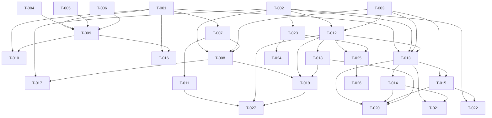

# Build Site: Cavekit Teams V1

Derived from `kit-team.md` (R1–R9), `kit-team-cli.md` (R1–R7), `kit-team-tui.md` (R1–R6).
22 kit requirements → 27 tasks across 5 tiers. Tier 0 has 6 parallel leaves.

## Tier 0 — Foundations (no deps)

| Task | Title | Cavekit | Requirement | blockedBy | Effort |
|------|-------|---------|-------------|-----------|--------|
| T-001 | Identity resolver + `identity.json` persistence (`internal/team/identity`) | kit-team | R4 | — | M |
| T-002 | Ledger append + tail-read primitives in `internal/team/ledger` (JSONL schema, malformed-line skip, ordering) | kit-team | R2 | — | M |
| T-003 | Lease file primitive in `internal/team/lease` (O_EXCL create, JSON shape, freshness check, config-driven TTL) | kit-team | R3 | — | M |
| T-004 | `.gitignore` block patcher with markers (`internal/team/gitpatch` or similar) | kit-team-cli | R4 | — | M |
| T-005 | `.gitattributes` block patcher + `merge=union` line for ledger | kit-team-cli | R5 | — | M |
| T-006 | Roster template writer + `context/team/roster.md` template body | kit-team | R1 | — | M |

## Tier 1 — Protocol core & CLI skeleton

| Task | Title | Cavekit | Requirement | blockedBy | Effort |
|------|-------|---------|-------------|-----------|--------|
| T-007 | `cavekit team` subcommand router in `cmd/cavekit/main.go` + `cmd/cavekit/team_*.go` (public: init/join/status/claim/release/sync; internal `heartbeat` gated on `CAVEKIT_INTERNAL=1`) | kit-team-cli | R1 | T-001 | M |
| T-008 | Per-subcommand flag parsing, `--json` mode, exit-code matrix, `schema: cavekit.team.v1` envelope | kit-team-cli | R2 | T-007, T-002, T-003 | M |
| T-009 | `team init` implementation: scaffold `.cavekit/team/`, write `config.json`, invoke T-004/T-005/T-006, resolve identity via T-001, `--force` semantics | kit-team-cli | R1, R4, R5 | T-001, T-004, T-005, T-006 | M |
| T-010 | `team join` implementation: identity resolution, idempotent re-join, `--strict` flag, exit codes | kit-team-cli | R2 | T-001, T-009 | M |
| T-011 | `/ck:team` slash-command dispatcher at `commands/ck/team.md` (single file, multi-verb, opt-in docs, exit-code passthrough) | kit-team-cli | R3 | T-007 | M |

## Tier 2 — Claim/release/heartbeat protocol & gates

| Task | Title | Cavekit | Requirement | blockedBy | Effort |
|------|-------|---------|-------------|-----------|--------|
| T-012 | Currently-held-claims computation (R5 Step 2): ledger scan, session/heartbeat/TTL join, deterministic ordering | kit-team | R5 | T-002, T-003 | M |
| T-013 | `team claim` six-step protocol: pull, check, lease, append, commit, push-retry/rebase; exit codes 3/4/5/6 and idempotent re-claim | kit-team | R5 | T-001, T-002, T-003, T-012 | M |
| T-014 | `team release` + `team complete` (via `--complete` on release): ledger append, lease delete, commit, unclaimed-guards (warn-only on release; exit 6 on complete) | kit-team | R6 | T-013 | M |
| T-015 | `team heartbeat` daemon: atomic lease rewrite, ledger tick, jittered cadence, dual-failure auto-release with `heartbeat failure` note | kit-team | R8 | T-003, T-013 | M |
| T-016 | `scripts/setup-build.sh` team-mode gate: detect tracked ledger via git index, require `identity.json`, exit 10 before any worktree/tmux side effect, smoke fixture | kit-team-cli | R6 | T-001, T-009 | M |
| T-017 | `team sync` subcommand: `git fetch` with `--timeout`, ledger re-read, exit 7 on failure, JSON output | kit-team-cli | R2 | T-008, T-002 | M |

## Tier 3 — Integration (frontier, dispatch, recovery)

| Task | Title | Cavekit | Requirement | blockedBy | Effort |
|------|-------|---------|-------------|-----------|--------|
| T-018 | Frontier filter in `internal/site/frontier.go`: post-filter `ReadyTasks` by held-claims set, exclude own non-active session claims, no-op when team mode absent | kit-team | R7 | T-012 | M |
| T-019 | `team status` subcommand + JSON report (`frontier_raw`, `frontier_filtered`, `excluded_by_team`; `--task` / `--user` filters) | kit-team-cli | R2 | T-008, T-012, T-018 | M |
| T-020 | Make-loop dispatch integration in `commands/ck/make.md` + `scripts/cavekit-tools.cjs` mark-complete wrapper: claim → spawn heartbeat PID → run → release/complete with SIGTERM(5s)/SIGKILL cleanup; preserve `.loop.lock`; ledger `complete` ordered before `task-status.json` | kit-team-cli | R7 | T-013, T-014, T-015, T-018 | M |
| T-021 | Crash-recovery + stale-lease steal reconciliation (startup sweep for own-session claims with missing lease; `stolen stale <owner>` notes; `backfill` completion acceptance; idempotence) | kit-team | R9 | T-013, T-014 | M |

## Tier 4 — TUI, non-interactive status, compaction

| Task | Title | Cavekit | Requirement | blockedBy | Effort |
|------|-------|---------|-------------|-----------|--------|
| T-022 | `cavekit team compact`: truncate heartbeat lines >24h, atomic rewrite-and-rename, `compact: ledger` commit | kit-team | R8 | T-002, T-015 | M |
| T-023 | fsnotify ledger watch + polling fallback (`CAVEKIT_TEAM_FORCE_POLL=1`, 2s mtime poll), byte-offset tail read, `fsnotify` go.mod pin, watch parent dir for rename-replace | kit-team-tui | R3 | T-002 | M |
| T-024 | `git fetch` scheduler goroutine: 30s default via `fetch_interval_seconds` (0 disables), 10s context timeout, pause on unpushed ledger commits, status-bar indicator with offline flip after 3 failures | kit-team-tui | R4 | T-023 | M |
| T-025 | Team Activity panel + per-user summary in `cavekit monitor` (20-row table newest-first, scroll to 200, footer counters; per-user strip with stale marker, own-row-first, shared ledger read) | kit-team-tui | R1, R2 | T-012, T-023 | M |
| T-026 | TUI color coding reusing existing accent palette + `NO_COLOR` text-tag fallback (`[own]`/`[stale]`/`[done]`) + lint test rejecting new color literals in team-panel source | kit-team-tui | R5 | T-025 | M |
| T-027 | `/ck:status --team` non-interactive summary: three sections (Active Claims / Recent Activity / Idle Members) + `--json` with `cavekit.team.v1` schema, TTY-aware color suppression, deterministic output, <1s on 10k lines | kit-team-tui | R6 | T-011, T-019, T-012 | M |

## Dependency Graph (Mermaid)

## Coverage Matrix

| Kit | Requirement | Covering Tasks |
|-----|-------------|----------------|
| kit-team | R1 (roster) | T-006, T-009 |
| kit-team | R2 (ledger) | T-002, T-022 |
| kit-team | R3 (leases) | T-003, T-015 |
| kit-team | R4 (identity) | T-001, T-009, T-010 |
| kit-team | R5 (claim protocol) | T-012, T-013 |
| kit-team | R6 (release/complete) | T-014 |
| kit-team | R7 (frontier filter) | T-018, T-019 |
| kit-team | R8 (heartbeat + compaction) | T-015, T-022 |
| kit-team | R9 (crash recovery) | T-021 |
| kit-team-cli | R1 (subcommand routing) | T-007, T-009 |
| kit-team-cli | R2 (flags/JSON/exit codes) | T-008, T-010, T-017, T-019 |
| kit-team-cli | R3 (slash commands) | T-011, T-027 |
| kit-team-cli | R4 (.gitignore patch) | T-004, T-009 |
| kit-team-cli | R5 (.gitattributes patch) | T-005, T-009 |
| kit-team-cli | R6 (setup-build gate) | T-016 |
| kit-team-cli | R7 (dispatch integration) | T-020 |
| kit-team-tui | R1 (activity panel) | T-025 |
| kit-team-tui | R2 (per-user summary) | T-025 |
| kit-team-tui | R3 (fsnotify + polling) | T-023 |
| kit-team-tui | R4 (fetch scheduler) | T-024 |
| kit-team-tui | R5 (color coding) | T-026 |
| kit-team-tui | R6 (`/ck:status --team`) | T-027 |

All 22 kit requirements covered. No gaps.
